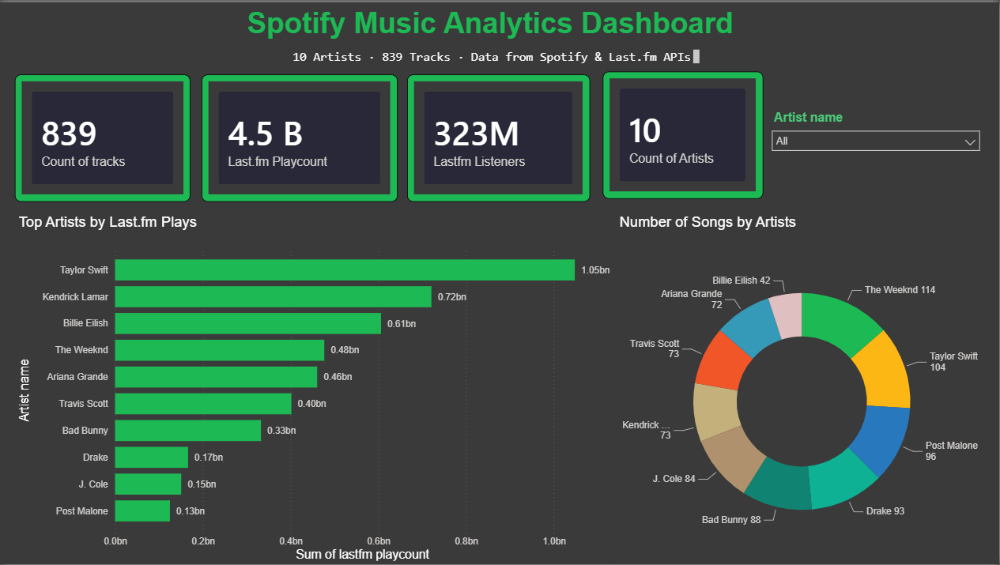
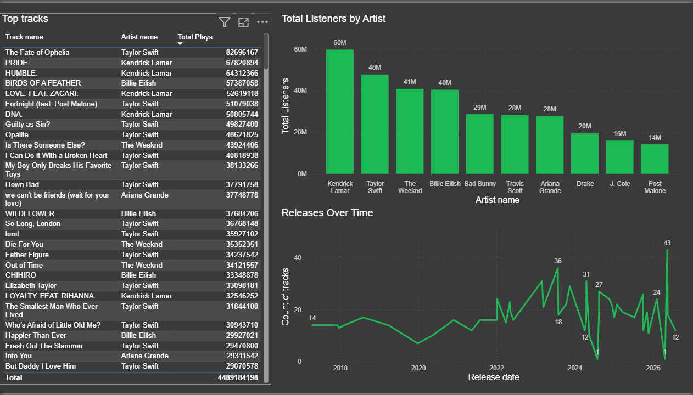
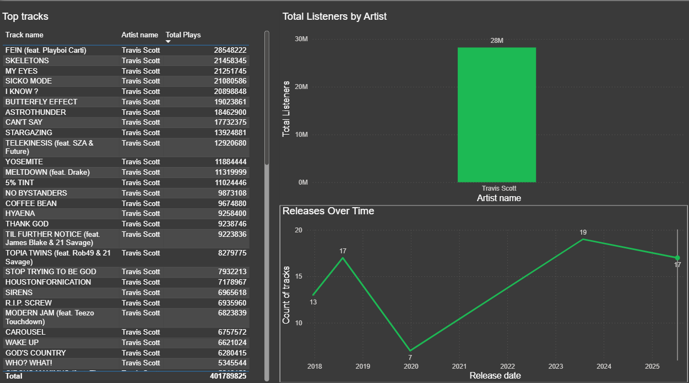
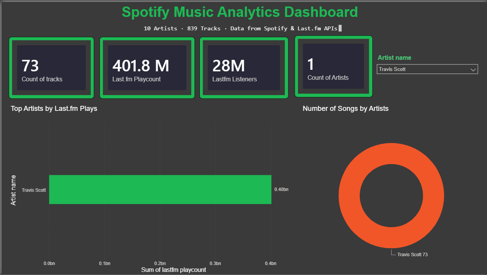

# Spotify ETL Pipeline

A production-ready Data Engineering pipeline that extracts music data from Spotify and Last.fm APIs, transforms it with Python and Pandas, loads it into a PostgreSQL star schema, schedules it with Apache Airflow, and visualizes it in Power BI.

---

## Architecture

```
┌──────────────────┐
│   Spotify API    │
│   Last.fm API    │
└────────┬─────────┘
         │
         ▼
┌──────────────────┐
│  Python ETL      │
│  (Pandas)        │
└────────┬─────────┘
         │
         ▼
┌──────────────────┐
│  PostgreSQL      │
│  (Star Schema)   │
└────────┬─────────┘
         │
    ┌────┴────┐
    ▼         ▼
┌────────┐ ┌────────┐
│Airflow │ │Power BI│
│(DAG)   │ │(Dashboard)
└────────┘ └────────┘
```

---

## Tech Stack

| Technology | Purpose |
|---|---|
| Python 3.14 | ETL scripting |
| Pandas | Data transformation |
| PostgreSQL 18 | Data warehouse |
| Apache Airflow 3 | Pipeline orchestration |
| Power BI | Data visualization |
| Docker | Containerization |
| GitHub | Version control |

---

## Data Model (Star Schema)

```
┌──────────────┐     ┌──────────────┐
│  dim_artist  │     │  dim_album   │
│──────────────│     │──────────────│
│ artist_id PK │◄────│ artist_id FK │
│ artist_name  │     │ album_id PK  │
│ genres       │     │ album_name   │
└──────────────┘     │ album_type   │
                     │ release_date │
                     └──────┬───────┘
                            │
┌──────────────┐            │
│  dim_track   │            │
│──────────────│            │
│ track_id PK  │◄───────────┘
│ track_name   │
│ duration_ms  │
│ is_explicit  │
└──────┬───────┘
       │
       ▼
┌──────────────────┐
│  fact_tracks     │
│──────────────────│
│ track_id FK      │
│ artist_id FK     │
│ album_id FK      │
│ duration_ms      │
│ lastfm_listeners │
│ lastfm_playcount │
│ load_date        │
└──────────────────┘
```

---

## Dashboard
### Page 1 — Executive Overview


### Page 2 — Detailed Analysis


### Filtered View — Travis Scott Selected


---

## Setup Instructions

### Prerequisites
- Python 3.11+
- PostgreSQL 18
- Docker Desktop
- Power BI Desktop

### 1. Clone the Repository
```bash
git clone https://github.com/Bhushan9-afk/Spotify_ETL_Project.git
cd Spotify_ETL_Project
```

### 2. Install Python Dependencies
```bash
pip install -r requirements.txt
```

### 3. Set Up PostgreSQL
```sql
CREATE DATABASE spotify_etl;
```

### 4. Configure Environment Variables
Create a `.env` file:
```
SPOTIFY_CLIENT_ID=your_client_id
SPOTIFY_CLIENT_SECRET=your_client_secret
LASTFM_API_KEY=your_lastfm_key
```

### 5. Run the ETL Pipeline
```bash
python scripts/etl.py
```

### 6. Start Airflow
```bash
airflow standalone
```

### 7. Open Power BI
Connect to `localhost:5432` → `spotify_etl` database.

---

## Folder Structure

```
Spotify_ETL_Project/
├── data/               # Raw and processed data
├── sql/                # SQL scripts
├── scripts/            # Python ETL scripts
├── airflow/            # Airflow DAGs
├── dashboard/          # Power BI files
├── screenshots/        # Dashboard screenshots
├── docs/               # Documentation
├── docker/             # Docker configuration
├── tests/              # Unit tests
├── README.md
├── requirements.txt
└── .gitignore
```

---

## Key Metrics

| Metric | Value |
|---|---|
| Artists | 10 |
| Albums | 50 |
| Tracks | 839 |
| Data Sources | Spotify API + Lastfm API |

---

## Lessons Learned

1. **API Rate Limiting**: Spotify enforces strict rate limits. Implemented retry logic with exponential backoff.
2. **Star Schema Design**: Separating fact and dimension tables improves query performance and maintainability.
3. **WSL2 Networking**: WSL2 has a separate network namespace from Windows. Used host IP for cross-environment connectivity.
4. **Docker Hub Reliability**: Registry pulls can be blocked by network-level TLS resets. Documented as a known limitation.

---

## Future Improvements

- [ ] Add more data sources (Genius for lyrics, YouTube for video metrics)
- [ ] Implement incremental loading (only new/changed data)
- [ ] Add data quality checks (Great Expectations)
- [ ] Deploy to cloud (AWS RDS + EC2)
- [ ] Add CI/CD pipeline (GitHub Actions)
- [ ] Implement real-time streaming (Kafka + Spark)

---

## Author

**Bhushan** — Data Engineer

[GitHub](https://github.com/Bhushan9-afk) | [LinkedIn](https://www.linkedin.com/in/bhushan-sarwade/)
---

## License

MIT License
